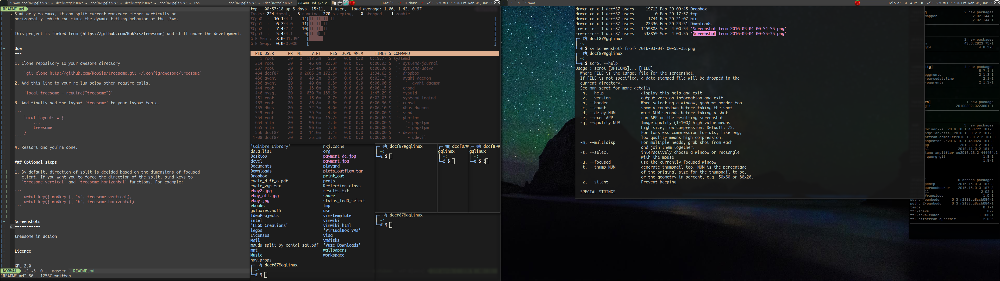

Treesome
========

Treesome is binary tree-based, dynamical tiling layout for Awesome 3.5 and
latter.  Similarly to tmux or i3wm, if a new client/window is created, 
the screen area occupied by the previous focused client (progenitor) will be
split vertically or horizontally and shared equally by the new and the previous
focused client (descendants).  Each time the spilt can either be specified or depends on
which side (width or height) of the screen area of the previous focused client (progenitor)
is longer. If you want, you can also manually resize these two descendants with
respect to each other, but only in the frame of screen area occupied by the
progenitor (which can be improved in the future).  

This project is forked from (https://github.com/RobSis/treesome) and still under the development.


Installation
---

1. Clone repository to your awesome directory

    ```
    git clone http://github.com/guotsuan/treesome.git ~/.config/awesome/treesome
    ```

2. Add this line to your rc.lua below other require calls.

    ```lua
    local treesome = require("treesome")`
    ```

3. And finally add the layout `treesome` to your layout table.
    ```lua
    local layouts = {
        ...
        treesome
    }
    ```
4. ##### Important Option:
    if you set the in your `rc.lua` to let the new created client gain the focus, 
    for example: 
    ```lua
    ...
        { rule = { },
          properties = { focus = awful.client.focus.filter, 
             -- or focus = true,

    ...
    ```

    then you should set the following option to make sure treesome works correctly 
    ```lua
    treesome.focusnew = true  
    ```
    If no extra settings about focus are added in your rc.lua, please set 
    ```lua
    treesome.focusnew = false
    ```
5. Restart and you're done. 


Configuration
----

1. The following option controls the new client apprear on the left or the right side
    of current client: 
    ```lua
    treesome.direction = "right" -- or "left"
    ```

1. By default, direction of split is decided based on the dimensions of the last focused
   client. If you want you to force the direction of the split, bind keys to
   `treesome.vertical` and `treesome.horizontal` functions. For example:

    ```lua
    awful.key({ modkey }, "v", treesome.vertical),
    awful.key({ modkey }, "h", treesome.horizontal)
    ```


Screenshots
-----------



TODO
----------
1. The resizing of clients can be improved


Licence
-------

[GPL 2.0](http://www.gnu.org/licenses/gpl-2.0.html)
